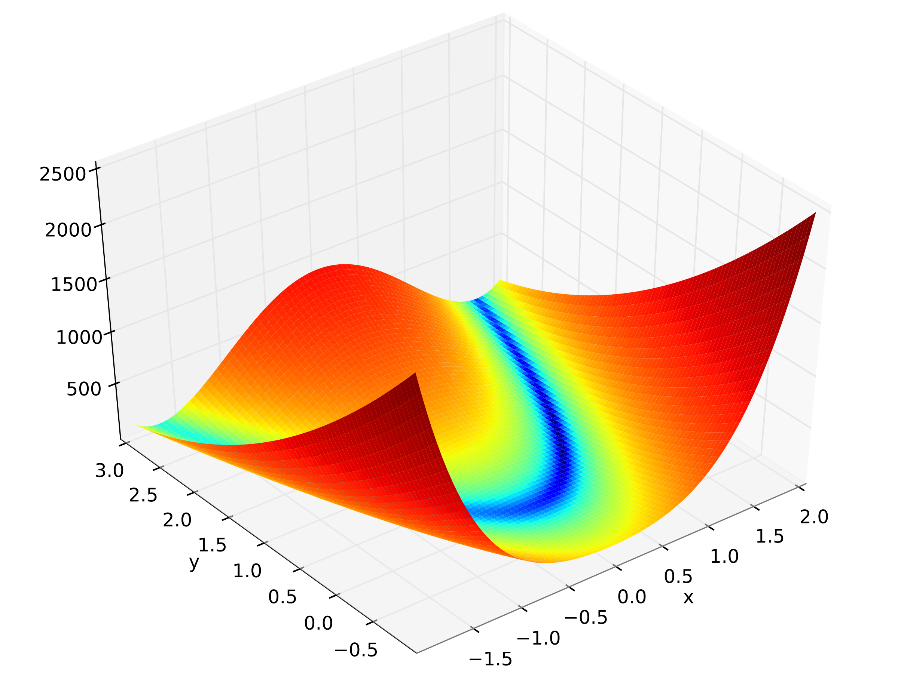
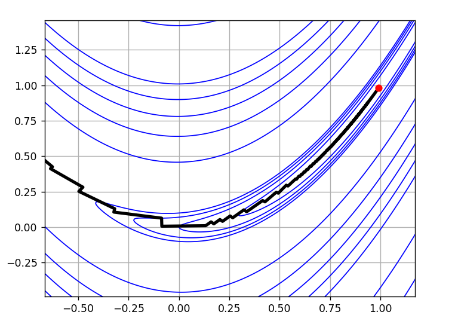
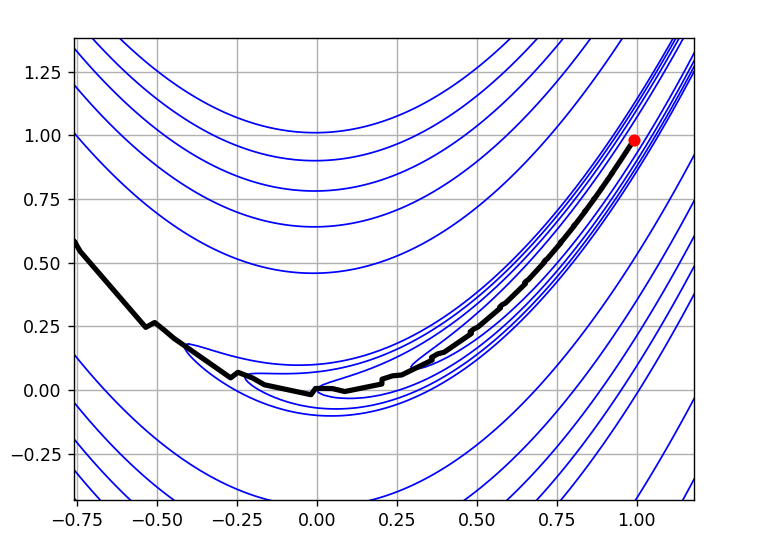
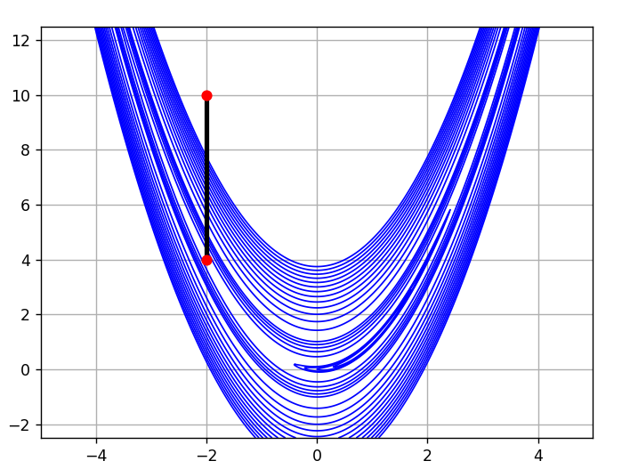
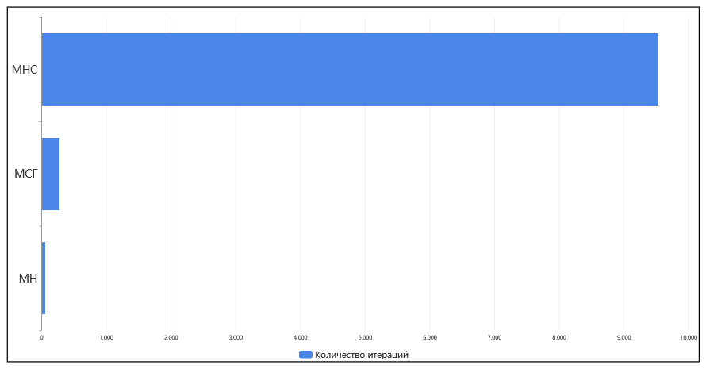
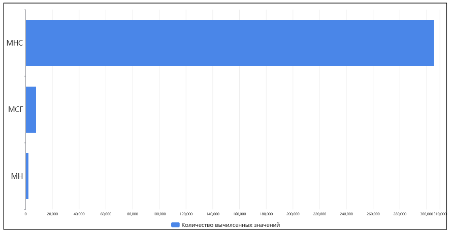

# nummethods 

В данном репозитории собраны реализации некоторых численных методов оптимизации (минимизации) на языке программирования Python 3.12.2.

• [Применение](#применение)\
• [Минимизируемая функция](#минимизируемая-функция)\
• [Метод наискорейшего спуска](#метод-наискорейшего-спуска)\
• [Метод сопряженных градиентов](#метод-сопряженных-градиентов)\
• [Метод Ньютона](#метод-ньютона)\
• [Метод циклического покоординатного спуска](#метод-циклического-покоординатного-спуска)\
• [Результаты применения](#результаты-применения)

## Применение

Для начала нужно установить все необходимые пакеты Python. Файл `requirements.txt`, в котором собран весь список зависимостей, находится в директории `nummethods/src`. Произвести установку зависимостей можно следующей командой:

```bash
pip install -r requirements.txt
```

Исходный код всех методов минимизации представлен в директории `nummethods/src`. Для запуска какого-либо метода нужно выполнить команду:

```bash
python method_name accuracy start_x start_y
```

Например, если мы хотим запустить метод наискорейшего спуска из начальной точки $(x, y) = (0, 14)$ с точностью $10^{-2}$, то команда будет выглядеть следующим образом:

```bash
python fastest_descent.py 0.01 0 14
```

## Минимизируемая функция

Для проверки правильности работы всех методов используется функция Розенброка:

$$f(x, y) = (1 - x)^2 + 100 \cdot (y - x^2)^2.$$

Она имеет глобальный минимум в точке $(x, y) = (1, 1)$, где $f(x, y) = 0$.

<p align="center">
  
</p>

## Метод наискорейшего спуска

Исходный код метода наискорейшего спуска представлен в файле `fastest_descent.py`.

Направление спуска в методе наискорейшего спуска совпадает с направлением антиградиента минимизируемой целевой функции $f(x, y)$, а элементы релаксационной последовательности $x^k$ строим при помощи рекурентного соотношения вида:

$$x^k = x^{k - 1} + \xi^k \omega^k; \text{ } k \in \mathbb{N}; \text{ } \xi > 0,$$

где $\omega^k = -grad f(x^{k-1})$ — антиградиент целевой функции в точке  x^{k-1}$, $k$ — номер текущей итерации спуска. Значение $\xi^k$ на каждой итерации выбирается путем минимизации функции:

$$\psi^k(\xi) = f(x^{k-1} + \xi \omega^k); \text{ } k \in \mathbb{N}; \text{ } \xi > 0.$$

В качестве критерия останова выбрано условие:

$$\left| \omega^k \right| < \epsilon; \text{ } k \in \mathbb{N}; \text{ } \epsilon > 0,$$

где $\epsilon$ — заданная точность.

## Метод сопряженных градиентов

Исходный код метода сопряженных градиентов представлен в файле `conjugate_gradient.py`.

Направление спуска в методе сопряженных градиентов определяется вектором $p$, вычисляющегося по формуле:

$$p^{k} = \gamma^{k-1} p^{k-1} + \omega^k; \text{ } k \in \mathbb{N}; \text{ } p^1 = \omega^1,$$

где $\omega^k = -grad f(x^{k-1})$ — антиградиент целевой функции в точке $x^{k-1}$, $k$ — номер текущей итерации спуска. Значение $\gamma^k$ на каждой итерации вычисляется по формуле:

$$\gamma^k = - \frac{(H(x^k)p^k, \omega^{k+1})}{(H(x^k)p^k, p^k)}; \text{ } k \in \mathbb{N},$$

где $H(x^k)$ — матрица Гессе целевой функции в точке $x^k$.

С целью ослабить влияние погрешностей, в данном методе применяется процедура "обновления" алгоритма. Суть процедуры заключается в том, что периодически через заданное число итераций принимаем $\gamma^k =  $. Соответсвующий номер итерации называется моментом обновления алгоритма. Множество таких моментов имеет вид:

$$n, 2n, ..., mn; \text{ } m \in \mathbb{N}.$$ 

Элементы релаксационной последовательности $x^k$ строим при помощи рекурентного соотношения вида:

$$x^k = x^{k - 1} + \xi^k p^k; \text{ } k \in \mathbb{N}; \text{ } \xi > 0.$$

Значение $\xi^k$ на каждой итерации выбирается путем минимизации функции:

$$\psi^k(\xi) = f(x^{k-1} + \xi p^k); \text{ } k \in \mathbb{N}; \text{ } \xi > 0.$$

В качестве критерия останова выбрано условие:

$$\left| \omega^k \right| < \epsilon; \text{ } k \in \mathbb{N}; \text{ } \epsilon > 0,$$

где $\epsilon$ — заданная точность.

## Метод Ньютона

Исходный код метода Ньютона представлен в файле `newton.py`.

Направление спуска в методе Ньютона определяется вектором $p$, который находят из решения системы линейных алгебраических уравнений:

$$\widetilde{H^k} p^k = -grad f(x^{k-1}); \text{ } k \in \mathbb{N},$$

где $\widetilde{H^k}$ — положительно определенная матрица Гессе целевой функции в точке $x^{k-1}$, $k$ — номер текущей итерации спуска. В случае, если матрица в точке $x^{k-1}$ положительно определенной не является, необходимо в ниже приведенной формуле подобрать такой параметр $\eta^k$, при котором матрица Гессе $H(x^{k-1})$ будет определена положительно: 

$$\widetilde{H^k} = \eta^k I_n + H(x^{k-1}); \text{ } k \in \mathbb{N},$$

где $I_n$ — единичная матрица порядка $n$.

Элементы релаксационной последовательности $x^k$ строим при помощи рекурентного соотношения вида:

$$x^k = x^{k - 1} + \xi^k p^k; \text{ } k \in \mathbb{N}; \text{ } \xi > 0.$$

Значение $\xi^k$ на каждой итерации выбирается путем минимизации функции:

$$\psi^k(\xi) = f(x^{k-1} + \xi p^k); \text{ } k \in \mathbb{N}; \text{ } \xi > 0.$$

В качестве критерия останова выбрано условие:

$$\left| \omega^k \right| < \epsilon; \text{ } k \in \mathbb{N}; \text{ } \epsilon > 0,$$

где $\epsilon$ — заданная точность. 

## Метод циклического покоординатного спуска

Исходный код метода Ньютона представлен в файле `cyclic_coordinate_descent.py`.

В методе циклического покоординатного спуска на каждой итерации алгоритма проводится одномерная минимизация целевой функции последовательно по каждой из $n$ координат ее аргумента $x \in \mathbb{R}$:

$$\phi_j^k(\alpha) = f(x^{k-1} + \alpha e_j); \text{ } k \in \mathbb{N}; \text{ } j = \overline{1, n},$$

где $e_i$, $i =  \overline{1, n}$ — стандартный базис в $\mathbb{R}^n$, $k$ — номер текущей итерации спуска.

Элементы релаксационной последовательности $x^k$ строим при помощи рекурентного соотношения вида:

$$x_j^k = x_j^{k-1} + \alpha_j^k; \text{ } k \in \mathbb{N}; \text{ } j = \overline{1, n}.$$

В качестве критерия останова выбрано условие:

$$\left| x^k - x^{k-1} \right| = \alpha^k < \epsilon; \text{ } k \in \mathbb{N}; \text{ } \epsilon > 0$$

или/и

$$\left| f(x^k) - f(x^{k-1}) \right| < \epsilon; \text{ } k \in \mathbb{N}; \text{ } \epsilon > 0,$$

где $\epsilon$ — заданная точность.

## Результаты применения

Входные параметры для всех методов выбраны следующие:

| Точность | Начальная точка |
| :---: | :---: |
| $10^{-2}$ | $(-2, 10)$ |

Выходные параметры включают в себя релаксационную последовательность, вычисленные значения целевой функции в каждой точке релаксационной последовательности, количество итераций и общее количество вычисленных значений целевой функции. Примем, что вычисление одного антиградиента равняется двум вычисленным значениям целевой функции, а вычисление одной матрицы Гессе равняется четырем вычисленным значениям целевой функции.

Во всех методах для одномерной минимизации использован метод золотого сечения, исходный код которого представлен в файле `minimization.py`.

Для вывода информации о работе каждого метода и построения графиков релаксационных последовательностей используются функции `output_method_data()` и `plot_relaxation_sequence()`, иcходный код которых представлен в файле `outputm.py`. 

Полученные результаты:\
• [Результаты применения метода наискорейшего спуска](#результаты-применения-метода-наискорейшего-спуска)\
• [Результаты применения метода сопряженных градиентов](#результаты-применения-метода-сопряженных-градиентов)\
• [Результаты применения метода Ньютона](#результаты-применения-метода-ньютона)\
• [Результаты применения метода циклического покоординатного спуска](#результаты-применения-метода-циклического-покоординатного-спуска)\
• [Сравнение полученных результатов](#сравнение-полученных-результатов)

### Результаты применения метода наискорейшего спуска

<p align="center">
  
</p>    

| Точка минимума | Минимальное значение | Количество итераций | Количество вычисленных значений|
| :---: | :---: | :---: | :---: |
| $(0.99, 0.98)$ | $0.00$ | $9537$ | $305184$ |

### Результаты применения метода сопряженных градиентов

<p align="center">
  
</p>    

| Точка минимума | Минимальное значение | Количество итераций | Количество вычисленных значений|
| :---: | :---: | :---: | :---: |
| $(0.99, 0.98)$ | $0.00$ | $273$ | $7648$ |

### Результаты применения метода Ньютона

<p align="center">
  
</p>    

| Точка минимума | Минимальное значение | Количество итераций | Количество вычисленных значений|
| :---: | :---: | :---: | :---: |
| $(1.00, 1.00)$ | $0.00$ | $50$ | $2100$ |

### Результаты применения метода циклического покоординатного спуска

<p align="center">
  
</p>    

| Точка минимума | Минимальное значение | Количество итераций | Количество вычисленных значений|
| :---: | :---: | :---: | :---: |
| $(-2.00, 4.00)$ | $9.00$ | $2$ | $119$ |

### Сравнение полученных результатов

Проанализировав ранее приведенные результаты можно заметить, что не все методы смогли достичь точки минимума. Метод циклического покоординатного спуска "застрял в овраге" функции Розенброка и прекратил дальнейшее выполнение своего алгоритма. Следовательно, можно сделать вывод о том, что метод циклического покоординатного спуска не подходит для применения с овражными функциями. Данный метод не будет учитываться при дальнейшем рассмотрении результатов.

Полученные данные от других методов совпали с теоретическими. Для того чтобы сделать какие-то выводы о их работе, нужно оценить количество итераций, затраченных на выполнение алгоритма, и количество вычисленных значений целевой функции.

<p align="center">
  
</p>    

<p align="center">
  
</p>    

Проанализировав графики, можно сделать вывод о том, что метод наискорейшего спуска достаточно плохо показывает себя при работе с овражными функциями, являясь медленным и дорогим (с точки зрения количества итераций и количества вычисленных значений). Метод сопряженных градиентов и метод Ньютона досотигли точки минимума за относительно небольшое количество итераций, совершив досточно маленькое количество вычислений целевой функции (по сравнению с методом наискорейшего спуска).